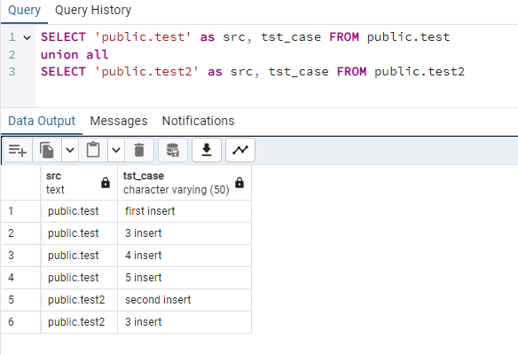

> Занятие 13  
Репликации в PostgreSQL.

Список ВМ с PG:
- 1 ВМ - порт 5432
- 2 ВМ - порт 5433
- 3 ВМ - порт 5434
- 4 ВМ - порт 5435

---
Упражнение 1 
--- 

Команды выполняемые на 1 ВМ:
```sql
alter system set wal_level = logical;
create database otus;
\c otus
create table test (tst_case varchar(50));
create table test2 (tst_case varchar(50));
create publication test_pub for table test;
-- после 1 блока команд на 2 ВМ:
create subscription test2_sub
connection 'host=localhost port=5433 user=postgres password=postgres dbname=otus'
publication test2_pub with (copy_data = true);
```
Команды выполняемые на 2 ВМ:
```sql
alter system set wal_level = logical;
create database otus;
\c otus
create table test (tst_case varchar(50));
create table test2 (tst_case varchar(50));
create publication test2_pub for table test2;
-- после 1 блока команд на 1 ВМ:
create subscription test_sub
connection 'host=localhost port=5432 user=postgres password=postgres dbname=otus'
publication test_pub with (copy_data = true);
```
Команды выполняемые на 3 ВМ:
```sql
create database otus;
\c otus
create table test (tst_case varchar(50));
create table test2 (tst_case varchar(50));

create subscription test_sub_1
connection 'host=localhost port=5432 user=postgres password=postgres dbname=otus'
publication test_pub with (copy_data = true);

create subscription test2_sub_2
connection 'host=localhost port=5433 user=postgres password=postgres dbname=otus'
publication test2_pub with (copy_data = true);
```

По итогу получаем что 1 ВМ реплицирует данные на ВМ 2 и 3 из таблицы test, а 2 ВМ на ВМ 1 и 3 из таблицы test2.

Если 3 ВМ будет подписана на все таблицы ВМ 1 и 2, то данные будут задваиваться. 

---
Упражнение 2*
---

Изменены настройки кластера 3 ВМ и перезапущен
```ini
wal_level = hot_standby
archive_mode = on
archive_command = 'cd .'
hot_standby = on
```
Остановлен кластер, изменены настройки 4 ВМ
```ini
wal_level = hot_standby
archive_mode = on
archive_command = 'cd .'
hot_standby = on
```
Далее выполнены следующие команды:
```bash
root@MSI:~# su - postgres
postgres@MSI:~$ cd /var/lib/postgresql/16/
postgres@MSI:~/16$ rm -rf main; mkdir main; chmod go-rwx main
postgres@MSI:~/16$ pg_basebackup -P -R -X stream -c fast -h localhost -p 5434 -U postgres -D ./main
Password:
30854/30854 kB (100%), 1/1 tablespace
postgres@MSI:~/16$ exit
root@MSI:~# sudo systemctl restart postgresql
```

---

Вкачестве проверки всех этапов, после каждого уровне репликации выполнялась вставка данных
- вставка в test на 1 ВМ, и проверка на 2 ВМ (**first insert**)
- вставка в test2 на 2 ВМ, и проверка на 1 ВМ (**second insert**)
- вставка в test на 1 ВМ и в test2 на 2 ВМ, и проверка на 3 ВМ (**3 insert**)
- вставка в test на 1 ВМ, и проверка на 4 ВМ (**4 insert**)
- вставка в test на 3 ВМ, и проверка на 4 ВМ чтобы убедиться что идет физическая репликация, а не логическая (т.к. был развернут бэкап, а ун уже содержал подписки) (**5 insert**)

Запрос с 4 ВМ:
