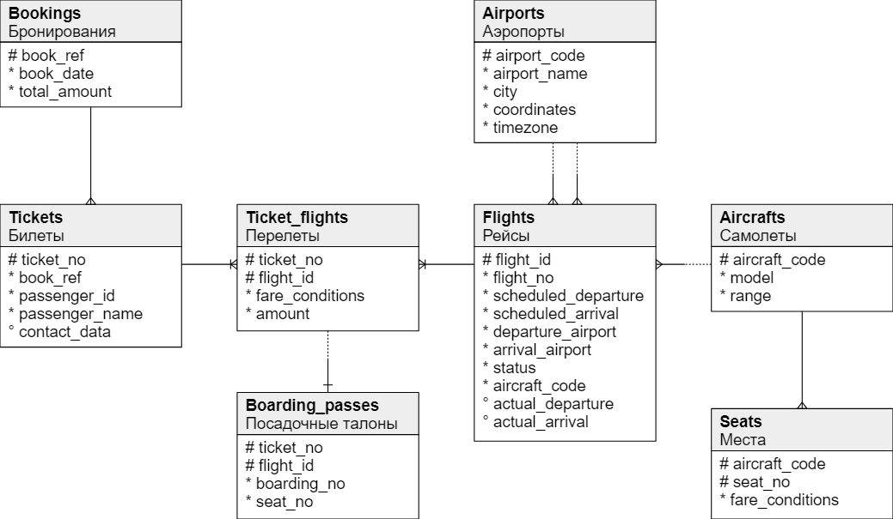
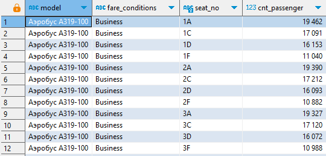
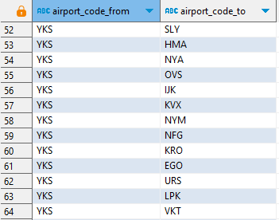
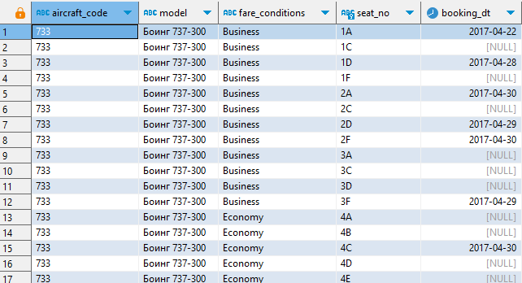

> Занятие 12  
Работа с join'ами и статистикой PostgreSQL.

Модель демо-базы авиаперелетов:


---
Запрос 1 
--- 

Запрос одновременно реализует **внутреннее** и **внешнее левостороннее** объединение, выборка демонстрирует статистику о количестве пассажиров на местах в самолетах:
```sql
select a.model, s.fare_conditions, s.seat_no, count(bp.ticket_no) cnt_passenger
  from aircrafts a 
  inner join seats s on s.aircraft_code = a.aircraft_code 
  left join boarding_passes bp on bp.seat_no = s.seat_no 
 group by a.model, s.fare_conditions, s.seat_no
 order by a.model, regexp_replace(s.seat_no, '\D', '')::int, regexp_replace(s.seat_no, '\d', '')
```


---
Запрос 2 
--- 

Запрос реализует **кросс** объединение, выборка демонстрирует все возможные комбинации рейсов:
```sql
select a1.airport_code as airport_code_from, a2.airport_code as airport_code_to 
  from airports a1 cross join airports a2
 where a1.airport_code != a2.airport_code;
```


---
Запрос 3 
--- 

Запрос реализует **полное** объединение (и другие для формирования предварительных данных), выборка демонстрирует статистику бронирования мест на конкретном рейсе на дату (условное допущение что место назначается при покупке билета):
```sql
 with aircraft_booking as (
	 select tf.flight_id, f.aircraft_code, bp.seat_no, date_trunc('day', b.book_date AT TIME ZONE '0')::date as dt
	   from ticket_flights tf
	   left join tickets t on t.ticket_no = tf.ticket_no 
	   left join bookings b on b.book_ref = t.book_ref 
	   left join flights f on f.flight_id = tf.flight_id 
	   left join boarding_passes bp on bp.ticket_no = tf.ticket_no and bp.flight_id = tf.flight_id
	  where date_trunc('day', b.book_date AT TIME ZONE '+0')::date <= '2017-04-30'::date
	  	and	tf.flight_id = 21998 and f.aircraft_code = '733'
	  order by regexp_replace(bp.seat_no, '\D', '')::int, regexp_replace(bp.seat_no, '\d', '') 
 ), aircraft_info as (
	 select a.aircraft_code, a.model, s.fare_conditions, s.seat_no
	   from aircrafts a 
	  inner join seats s on s.aircraft_code = a.aircraft_code 
	  where a.aircraft_code = '733'
 )
 select ai.aircraft_code, ai.model, ai.fare_conditions, ai.seat_no, ab.dt as booking_dt
   from aircraft_booking ab 
   full join aircraft_info ai ON ai.aircraft_code = ab.aircraft_code and ai.seat_no = ab.seat_no
  order by regexp_replace(ai.seat_no, '\D', '')::int, regexp_replace(ai.seat_no, '\d', '')   
  ```
  

---
Метрики* 
--- 

```sql
-- Топ таблиц в которых неиспользовалось чтение по индексу:
select * from pg_stat_user_tables t order by t.idx_scan nulls first limit 5;
-- Топ наименее вариативных данных в базе (возможно что то в справочники можно потом превратить):
select * from pg_stats t where t.schemaname = 'bookings' and t.n_distinct > 0 order by t.n_distinct limit 5
-- Список активных сессий к СУБД:
select * from pg_stat_activity t where t.state = 'active'
```