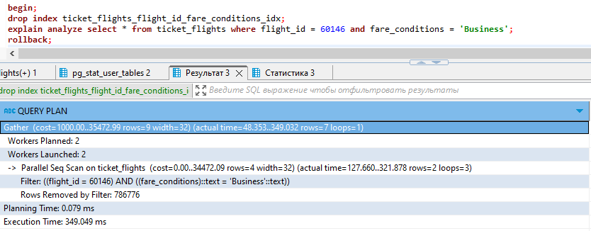
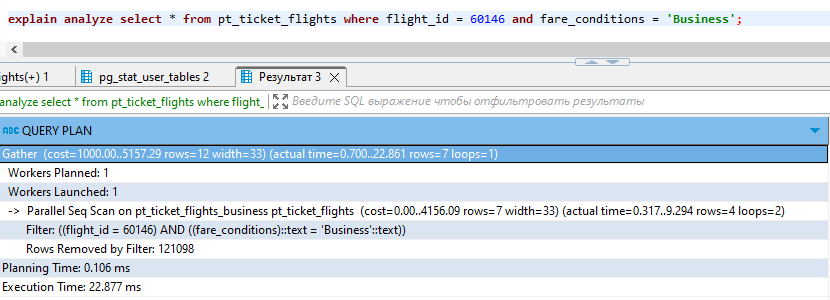

> Занятие 13 
Секционирование таблицы.

Добавим элитарности на уровень хранения данных, сделаем партицировнную таблицу купленных билетов, где под каждый класс обслуживания своя партиция: эконом, комфорт, бизнес.

```sql
-- создание партицированной таблицы 
CREATE TABLE bookings.pt_ticket_flights (
	ticket_no bpchar(13) NOT NULL,
	flight_id int4 NOT NULL,
	fare_conditions varchar(10) NOT NULL,
	amount numeric(10, 2) NOT NULL,
	CONSTRAINT pt_ticket_flights_amount_check CHECK ((amount >= (0)::numeric)),
	CONSTRAINT pt_ticket_flights_fare_conditions_check CHECK (((fare_conditions)::text = ANY (ARRAY[('Economy'::character varying)::text, ('Comfort'::character varying)::text, ('Business'::character varying)::text]))),
	CONSTRAINT pt_ticket_flights_pkey PRIMARY KEY (ticket_no, flight_id, fare_conditions)
)
PARTITION BY LIST (fare_conditions);

-- создание партиций
CREATE TABLE bookings.pt_ticket_flights_economy PARTITION OF bookings.pt_ticket_flights  FOR VALUES IN ('Economy');
CREATE TABLE bookings.pt_ticket_flights_comfort PARTITION OF bookings.pt_ticket_flights  FOR VALUES IN ('Comfort');
CREATE TABLE bookings.pt_ticket_flights_business PARTITION OF bookings.pt_ticket_flights  FOR VALUES IN ('Business');

-- переносим данные из исходной таблицы
insert into pt_ticket_flights (ticket_no,flight_id,fare_conditions,amount)
select ticket_no,flight_id,fare_conditions,amount from ticket_flights;
```
Условно доступ быстрее будет по классу


*индекс удаляется т.к. его нет на партицированной таблице

