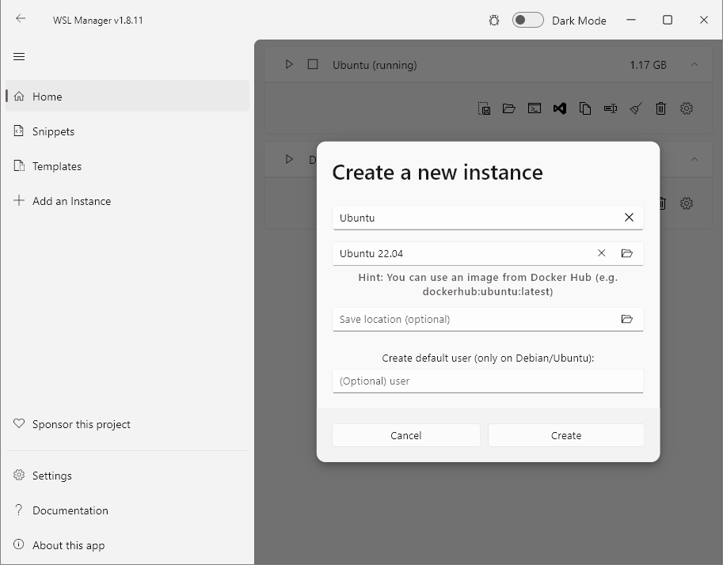
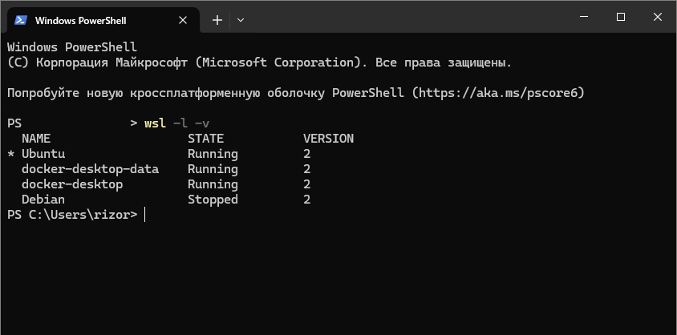
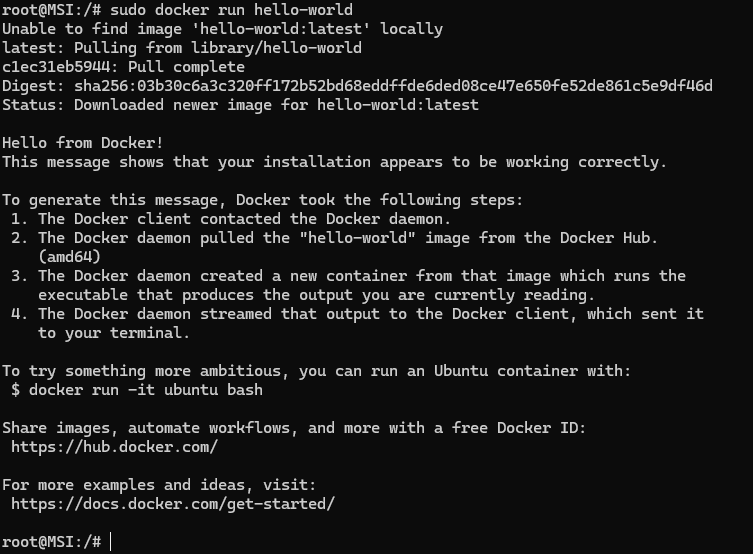
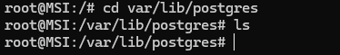
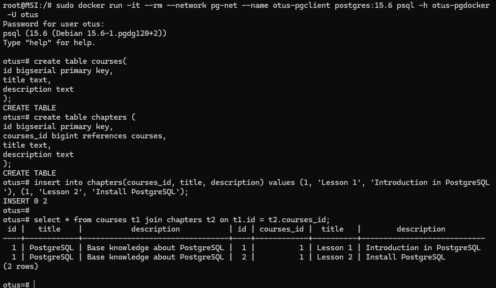
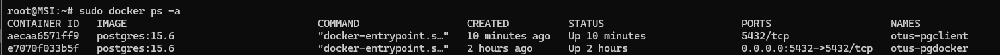
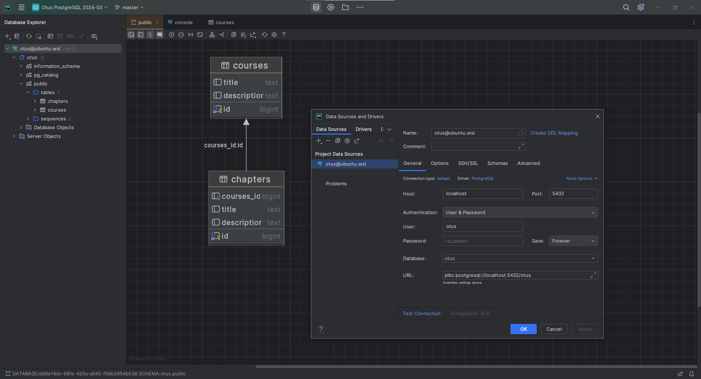

> Занятие 3  
Установка и настройка PostgteSQL в контейнере Docker.
---
Создание окружения
---
Имеется хост-машина под управлением Windows 10 c WSL.\
Так как окружение все было настроен, то для выполнения работы былустановлен отдельный инстанс Ubuntu.

Новый инстанс можно создать через командную строку или при помощи [WSL Manager](https://github.com/bostrot/wsl2-distro-manager/releases/tag/v1.8.11
) (очень удобно, особенно если нужно несколько инстансов одно ОС)

Создаю новый инстанс Ubuntu 22.04:


На хост-машине уже установлен Docker Desktop, он в свою очеред поднимает под WSL два собственных инстанса и работать он может только с тем инстансом, который установлен по умолчанию!

Устанавлеваем Ubuntu по умолчанию:
```ps
wsl --set-default Ubuntu
```
Проверяем список инстансов WSL:


Установка Docker Engine:
```bash
# Add Docker's official GPG key:
sudo apt-get update
sudo apt-get install ca-certificates curl
sudo install -m 0755 -d /etc/apt/keyrings
sudo curl -fsSL https://download.docker.com/linux/ubuntu/gpg -o /etc/apt/keyrings/docker.asc
sudo chmod a+r /etc/apt/keyrings/docker.asc

# Add the repository to Apt sources:
echo \
  "deb [arch=$(dpkg --print-architecture) signed-by=/etc/apt/keyrings/docker.asc] https://download.docker.com/linux/ubuntu \
  $(. /etc/os-release && echo "$VERSION_CODENAME") stable" | \
  sudo tee /etc/apt/sources.list.d/docker.list > /dev/null
sudo apt-get update

sudo apt-get install docker-ce docker-ce-cli containerd.io docker-buildx-plugin docker-compose-plugin
```

Проверка Docker


---
Запуск контейнера с базой
--- 
Создание каталога /var/lib/postgres
```bash
mkdir /var/lib/postgres
```
Создана пустая директория.


Запуск контейнер с PostgreSQL 15
```bash
sudo docker network create pg-net
docker run --rm --name otus-pgdocker --network pg-net -e POSTGRES_PASSWORD=otus -e POSTGRES_USER=otus -e POSTGRES_DB=otus -d -p 5432:5432 -v /var/lib/postgres:/var/lib/postgresql/data postgres:15.6
```

Запуск контейнера-клиента и подключение к базе:
```bash
sudo docker run -it --rm --network pg-net --name otus-pgclient postgres:15.6 psql -h otus-pgdocker -U otus
```
Создание объектов в базе
```sql
create table courses(
    id bigserial primary key,
    title text,
    description text
);

create table chapters (
    id bigserial primary key,
    courses_id bigint references courses,
    title text,
    description text
);

insert into courses(title, description) 
values ('PostgreSQL', 'Base knowledge about PostgreSQL');

insert into chapters(courses_id, title, description) 
values (1, 'Lesson 1', 'Introduction in PostgreSQL'), 
       (1, 'Lesson 2', 'Install PostgreSQL');

select * from courses t1 join chapters t2 on t1.id = t2.courses_id;
```



Проверяем что это 2 разных контейнера:


Подключение к базе через IDE на хост-машине


---
Удаление контейнера с базой и повторное создание
--- 

Так как при создании контейнера описан байндинг каталога с данными базы в контейнере на директорю в виртуальной машине, то остановка или пересоздание (с таким же байндингом) не приведет к потере данных. 
