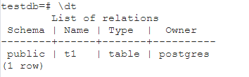

> Занятие 7  
Работа с базами данных, пользователями и правами.
---
Упражнение 1 
--- 
Создание базы, схемы, роли, пользователя и таблицы
```sql
postgres=# create database testdb;
CREATE DATABASE
postgres=# \c testdb
psql (16.2, сервер 15.6 (Debian 15.6-1.pgdg120+2))
Вы подключены к базе данных "testdb" как пользователь "postgres".
testdb=# create schema testnm;
CREATE SCHEMA
testdb=# create table t1 (c1 integer);
CREATE TABLE
testdb=# insert into t1 values(1);
INSERT 0 1
testdb=# create role readonly;
CREATE ROLE
testdb=# grant connect on database testdb to readonly;
GRANT
testdb=# grant usage on schema testnm to readonly;
GRANT
testdb=# grant select on all tables in schema testnm to readonly;
GRANT
testdb=# create user testread with password 'test123';
CREATE ROLE
testdb=# grant readonly to testread;
GRANT ROLE
testdb=# \c testdb testread
psql (16.2, сервер 15.6 (Debian 15.6-1.pgdg120+2))
Вы подключены к базе данных "testdb" как пользователь "testread".
testdb=> select * from t1;
ERROR:  permission denied for table t1
```
При создании таблиц (да и в целом объектов в схеме) необходимо указывать полное имя таблицы: **schema_name.table_name**, чтобы случайно не создавать объекты в схеме **public**.



Т.к. права к объектам **public** по умолчанию теперь отозваны, то и выборка вернула ошибку.

```sql
testdb=# create table testnm.t1(c1 integer);
CREATE TABLE
testdb=# insert into testnm.t1 values(1);
INSERT 0 1
testdb=# \c testdb testread
psql (16.2, сервер 15.6 (Debian 15.6-1.pgdg120+2))
Вы подключены к базе данных "testdb" как пользователь "testread".
testdb=> select * from testnm.t1;
ERROR:  permission denied for table t1
```
Выдача прав на все объекты схемы осуществляется в моменте выполнения комманды, при создании объектов после, то необходимо повторно выдавать права после создания объектов.

```sql
t1
testdb=> \c testdb postgres
psql (16.2, сервер 15.6 (Debian 15.6-1.pgdg120+2))
Вы подключены к базе данных "testdb" как пользователь "postgres".
testdb=# grant select on all tables in schema testnm to readonly;
GRANT
testdb=# \c testdb testread
psql (16.2, сервер 15.6 (Debian 15.6-1.pgdg120+2))
Вы подключены к базе данных "testdb" как пользователь "testread".
testdb=> select * from testnm.t1;
 c1
----
  1
```
Либо установить набор прав по умолчанию при создании объектов:
```sql
alter default privileges in schema testnm grant select on tables to readonly; 
```

С учетом последних версий СУБД где **public**-прав нет по умолчанию для новых пользователей:
```sql
testdb=# \c testdb testread
psql (16.2, сервер 15.6 (Debian 15.6-1.pgdg120+2))
Вы подключены к базе данных "testdb" как пользователь "testread".
testdb=> create table t2(c1 integer);
ERROR:  permission denied for schema public
```
В ранних версиях можно просто отозвать права.