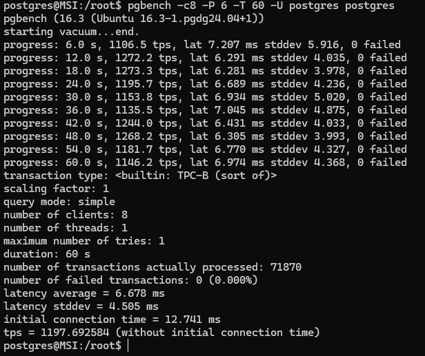
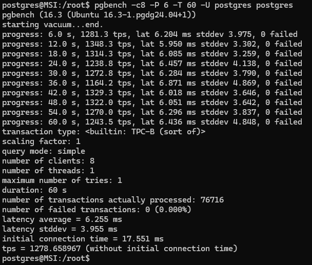

> Занятие 8  
MVCC, vacuum и autovacuum.
---
Упражнение 1 
--- 
Проверка производительности с настройками по умолчанию:



Проверка производительности с заданными настройками:



Прирост операций имеется, но не сильно заметный, скорее всего обусловлено тем что PG запущен не на ВМ с указанными настройками, а на WSL (оно и так пользует все железо)

---
Упражнение 2 
--- 
Создаем таблицу otus c полем txt text и запоняем 1 000 000 строк:

```sql
create table public.otus (txt text);

insert into public.otus (txt)
select left(md5(i::text), 10)
from generate_series(1, 1000000) s(i);
```
Проверяем размер, он равен **42 Мб**.
```sql
SELECT pg_size_pretty( pg_total_relation_size( 'otus' ) );
```
После обновления всех записей 5 раз, добавляя 1 символ на каждом проходе, имеем размер таблицы **253 Мб**.

После автовакуума размер таблицы не изменился! Т.к. не происходит реструктуризации "выделенной" памяти.

Повторное выполнение пятикратного обновления всех записей после автовакуума приводит таблицу к размеру **291 Мб**. Была повторно использована выделенная память, ну и еще немного сверху.

Снова случился автовакуум, и далее он отключен:
```sql
ALTER TABLE otus SET (autovacuum_enabled = false);
```

Проводится десятикратное обновление всех записей, после чего размер таблицы составляет **601 Мб**. Что соответствует 10 размерам таблицы (учитываем что каждая версия также приростает из-за увеличения значения в поле).

*Никакого не объяснимого поведения замечено не было.*

---
Упражнение 3*
--- 
Анонимная процедура вставки с промежуточным выводом шага:
```sql
DO 
$$
DECLARE 
  r record;
BEGIN
  FOR r IN SELECT table_schema, table_name FROM information_schema.tables 
  WHERE table_name = 'otus' AND table_schema = 'public'
  LOOP
	for counter in 1..10 loop
	  raise notice 'counter: %', counter;
      EXECUTE 'update '|| quote_ident(r.table_schema) || '.' || quote_ident(r.table_name) ||' set txt = txt || left(md5(txt), 1)';
   	end loop;
  END LOOP;
END;
$$
```