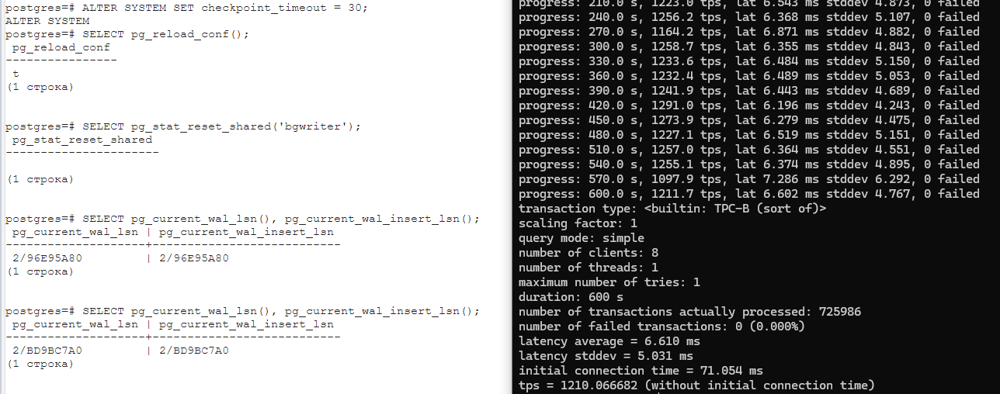

> Занятие 9  
Журналы.
---
Упражнение 1 
--- 
Настраиваем тайминг чекпоинтов, сбрасываем статистику и получаем LSN:
```sql
ALTER SYSTEM SET checkpoint_timeout = 30;
SELECT pg_reload_conf();
SELECT pg_stat_reset_shared('bgwriter');
SELECT pg_current_wal_lsn(), pg_current_wal_insert_lsn();
```
и запускаем pgbench:



В конце получаем новый LSN и можем посмотреть сами журналы:
```sql
SELECT pg_current_wal_lsn(), pg_current_wal_insert_lsn();
SELECT * FROM pg_ls_waldir() t where t.modification > '2024-05-25 19:47:00' order by 3;

SELECT '2/BD9BC7A0'::pg_lsn - '2/96E95A80'::pg_lsn as byte_size;
```

Размер журналов (~620 МБ) и статистика чекпоинтов:


Согласно логированию все чекпоинты выполнялись в соответствии с установленным интервалом, т.е. каждые 30. Полагаю это заслуга железа, что при заданной нагрузке PostgreSQL успевал за 25-27 сек делать запись. Возможно при большей нагрузке можно было бы наблюдать смещение времени или пропуски (в общем было бы меньше 20 чекпойинтов).


---
Упражнение 2
--- 
Сравнение tps в синхронном/асинхронном режиме утилитой pgbench:


В синхронном режиме 737.584194 tps против 1422.327725 в асинхронном.

Разница обусловлена ожиданием фоновых процессов репликации, каждая выполняемая транзакция ожидает подверждения о том, что все реплики получили и записали данные.

---
Упражнение 3
--- 
Начиная с 12 версии СУБД, нет необходимости создавать новый кластер, можно просто включить контрольные суммы:

```bash
postgres@MSI:/root$ /usr/lib/postgresql/16/bin/pg_checksums --pgdata /var/lib/postgresql/16/main --enable --progress
```


Создаем и заполняем таблицу, получаем ее расположение:
```sql
create table public.damage_data (data character(50));
insert into public.damage_data (data)
select left(md5(i::text), 30)
from generate_series(1, 100) s(i);

SELECT pg_relation_filepath('damage_data'); --base/5/16762
```

Ломаем файл дописав в него:


Пробуем выбрать данные:
```bash
postgres=# select * from damage_data;
WARNING:  page verification failed, calculated checksum 13230 but expected 14379
ERROR:  invalid page in block 0 of relation base/5/16762
```

Игнорировать предуприждение и ошибку можно при помощи включения настройки **ignore_checksum_failure** (актуально только если включен контроль сумм):
```sql
set ignore_checksum_failure = on;
```