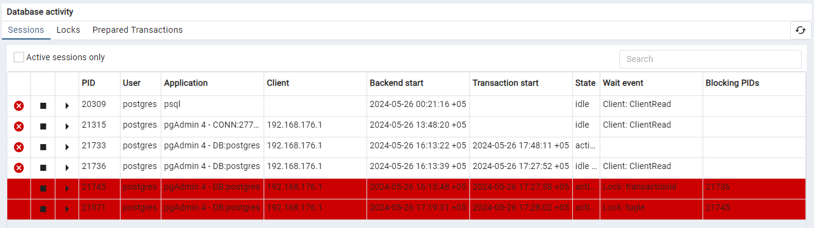
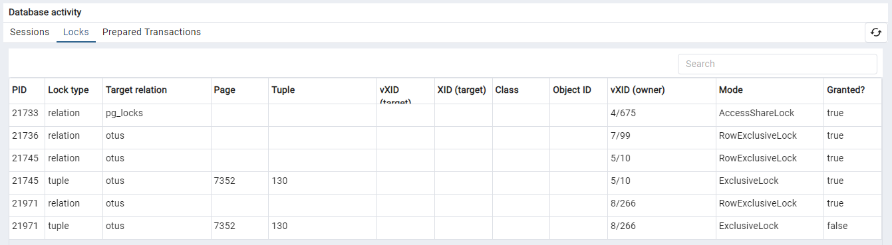
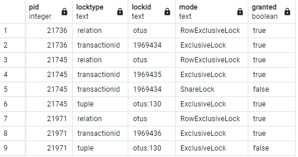
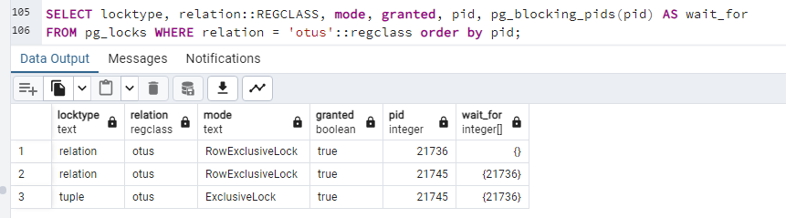

> Занятие 10  
Блокировки.
---
Упражнение 1 
--- 
Настройка СУБД для логирования блокировок:
```sql
alter system set log_lock_waits = on;
alter system set deadlock_timeout = '200ms';
select pg_reload_conf();
```
Выполняем обновление одной записи в разных сессиях и получаем запись в лог:
```
[21736] postgres@postgres LOG:  process 21736 still waiting for ShareLock on transaction 1969427 after 201.969 ms
[21736] postgres@postgres DETAIL:  Process holding the lock: 21745. Wait queue: 21736.
[21736] postgres@postgres CONTEXT:  while updating tuple (0,1) in relation "otus"
[21736] postgres@postgres STATEMENT:  update otus set txt = 'c4ca4238a0b923820dcc509a6f7584' where txt = 'c4ca4238a0b923820dcc509a6f7584';
```
---
Упражнение 2
--- 
В 3 сессиях запущен один и тот же запрос:
```sql
begin; 
update otus set txt = 'c4ca4238a0b923820dcc509a6f7584' where txt = 'c4ca4238a0b923820dcc509a6f7584';
```
Наблюдаем следущие сессии и блокировки в pgAdmin:




В логах:
```
[21745] postgres@postgres LOG:  process 21745 still waiting for ShareLock on transaction 1969434 after 200.374 ms
[21745] postgres@postgres DETAIL:  Process holding the lock: 21736. Wait queue: 21745.
[21745] postgres@postgres CONTEXT:  while updating tuple (7352,130) in relation "otus"
[21745] postgres@postgres STATEMENT:  update otus set txt = 'c4ca4238a0b923820dcc509a6f7584' where txt = 'c4ca4238a0b923820dcc509a6f7584';
[21971] postgres@postgres LOG:  process 21971 still waiting for ExclusiveLock on tuple (7352,130) of relation 16428 of database 5 after 200.600 ms
[21971] postgres@postgres DETAIL:  Process holding the lock: 21745. Wait queue: 21971.
[21971] postgres@postgres STATEMENT:  update otus set txt = 'c4ca4238a0b923820dcc509a6f7584' where txt = 'c4ca4238a0b923820dcc509a6f7584';
```
Исходя из этого видим:
- 1 сессия порождает **RowExclusiveLock** блокируя строку
- 2 сессия видит блокировку встает в ожидание и порождает **RowExclusiveLock**, и создает tuple* c **ExclusiveLock**, а также получает **ShareLock** на уровне транзакции, по отношению к первой, с отсутствующим доступом к данным
- 3 сессия аналогично порождает **RowExclusiveLock** и  **ExclusiveLock**, только запрет к данным на уровне созданного tuple
- по логу также видно что 3 сессия блокировку получает от созданного tuple

tuple* - Блокировка версии строки. Используется в некоторых случаях для установки приоритета среди нескольких транзакций, ожидающих блокировку одной и той же строки.

---
Упражнение 3
--- 
Взаимная блокировка 3 сессий.
Выполняем обновление 3 записей по 1 на сессию:
```sql
begin; -- 1 session
update otus set txt = 'c4ca4238a0b923820dcc509a6f7584' where txt = 'c4ca4238a0b923820dcc509a6f7584';

begin; -- 2 session
update otus set txt = 'c81e728d9d4c2f636f067f89cc1486' where txt = 'c81e728d9d4c2f636f067f89cc1486';

begin; -- 3 session
update otus set txt = 'eccbc87e4b5ce2fe28308fd9f2a7ba' where txt = 'eccbc87e4b5ce2fe28308fd9f2a7ba';
```
После, со смещением на один обновляем эти же записи:
```sql
-- 1 session for 2 session 
update otus set txt = 'c81e728d9d4c2f636f067f89cc1486' where txt = 'c81e728d9d4c2f636f067f89cc1486';
-- 2 session for 3 session 
update otus set txt = 'eccbc87e4b5ce2fe28308fd9f2a7ba' where txt = 'eccbc87e4b5ce2fe28308fd9f2a7ba';
-- 3 session for 1 session 
update otus set txt = 'c4ca4238a0b923820dcc509a6f7584' where txt = 'c4ca4238a0b923820dcc509a6f7584';
```
В 3 сессии получаем ошибку:
```
ERROR:  deadlock detected
ПОДРОБНОСТИ:  Process 21971 waits for ShareLock on transaction 1969437; blocked by process 21736.
Process 21736 waits for ShareLock on transaction 1969438; blocked by process 21745.
Process 21745 waits for ShareLock on transaction 1969439; blocked by process 21971.
ПОДСКАЗКА:  See server log for query details.
КОНТЕКСТ:  while updating tuple (7352,130) in relation "otus"
```
Логи:
```
[21745] postgres@postgres LOG:  process 21745 acquired ShareLock on transaction 1969434 after 8401744.902 ms
[21745] postgres@postgres CONTEXT:  while updating tuple (7352,130) in relation "otus"
[21745] postgres@postgres STATEMENT:  update otus set txt = 'c4ca4238a0b923820dcc509a6f7584' where txt = 'c4ca4238a0b923820dcc509a6f7584';
[21971] postgres@postgres LOG:  process 21971 acquired ExclusiveLock on tuple (7352,130) of relation 16428 of database 5 after 8397687.713 ms
[21971] postgres@postgres STATEMENT:  update otus set txt = 'c4ca4238a0b923820dcc509a6f7584' where txt = 'c4ca4238a0b923820dcc509a6f7584';
[21971] postgres@postgres LOG:  process 21971 still waiting for ShareLock on transaction 1969435 after 200.204 ms
[21971] postgres@postgres DETAIL:  Process holding the lock: 21745. Wait queue: 21971.
[21971] postgres@postgres CONTEXT:  while updating tuple (7352,130) in relation "otus"
[21971] postgres@postgres STATEMENT:  update otus set txt = 'c4ca4238a0b923820dcc509a6f7584' where txt = 'c4ca4238a0b923820dcc509a6f7584';
[21971] postgres@postgres LOG:  process 21971 acquired ShareLock on transaction 1969435 after 3457.833 ms
[21971] postgres@postgres CONTEXT:  while updating tuple (7352,130) in relation "otus"
[21971] postgres@postgres STATEMENT:  update otus set txt = 'c4ca4238a0b923820dcc509a6f7584' where txt = 'c4ca4238a0b923820dcc509a6f7584';
[21736] postgres@postgres LOG:  process 21736 still waiting for ShareLock on transaction 1969438 after 215.151 ms
[21736] postgres@postgres DETAIL:  Process holding the lock: 21745. Wait queue: 21736.
[21736] postgres@postgres CONTEXT:  while updating tuple (0,2) in relation "otus"
[21736] postgres@postgres STATEMENT:  update otus set txt = 'c81e728d9d4c2f636f067f89cc1486' where txt = 'c81e728d9d4c2f636f067f89cc1486';
[21745] postgres@postgres LOG:  process 21745 still waiting for ShareLock on transaction 1969439 after 207.438 ms
[21745] postgres@postgres DETAIL:  Process holding the lock: 21971. Wait queue: 21745.
[21745] postgres@postgres CONTEXT:  while updating tuple (0,3) in relation "otus"
[21745] postgres@postgres STATEMENT:  update otus set txt = 'eccbc87e4b5ce2fe28308fd9f2a7ba' where txt = 'eccbc87e4b5ce2fe28308fd9f2a7ba';
[21971] postgres@postgres LOG:  process 21971 detected deadlock while waiting for ShareLock on transaction 1969437 after 213.689 ms
[21971] postgres@postgres DETAIL:  Process holding the lock: 21736. Wait queue: .
[21971] postgres@postgres CONTEXT:  while updating tuple (7352,130) in relation "otus"
[21971] postgres@postgres STATEMENT:  update otus set txt = 'c4ca4238a0b923820dcc509a6f7584' where txt = 'c4ca4238a0b923820dcc509a6f7584';
[21971] postgres@postgres ERROR:  deadlock detected
[21971] postgres@postgres DETAIL:  Process 21971 waits for ShareLock on transaction 1969437; blocked by process 21736.
	Process 21736 waits for ShareLock on transaction 1969438; blocked by process 21745.
	Process 21745 waits for ShareLock on transaction 1969439; blocked by process 21971.
	Process 21971: update otus set txt = 'c4ca4238a0b923820dcc509a6f7584' where txt = 'c4ca4238a0b923820dcc509a6f7584';
	Process 21736: update otus set txt = 'c81e728d9d4c2f636f067f89cc1486' where txt = 'c81e728d9d4c2f636f067f89cc1486';
	Process 21745: update otus set txt = 'eccbc87e4b5ce2fe28308fd9f2a7ba' where txt = 'eccbc87e4b5ce2fe28308fd9f2a7ba';
[21971] postgres@postgres HINT:  See server log for query details.
[21971] postgres@postgres CONTEXT:  while updating tuple (7352,130) in relation "otus"
[21971] postgres@postgres STATEMENT:  update otus set txt = 'c4ca4238a0b923820dcc509a6f7584' where txt = 'c4ca4238a0b923820dcc509a6f7584';
[21745] postgres@postgres LOG:  process 21745 acquired ShareLock on transaction 1969439 after 8802.361 ms
[21745] postgres@postgres CONTEXT:  while updating tuple (0,3) in relation "otus"
[21745] postgres@postgres STATEMENT:  update otus set txt = 'eccbc87e4b5ce2fe28308fd9f2a7ba' where txt = 'eccbc87e4b5ce2fe28308fd9f2a7ba';
```

---
Упражнение 4*
--- 
Запускаем 2 транзакции и обновлющих таблицу целиком:
```sql
-- session 1
postgres=# begin;
BEGIN
postgres=*# update otus set txt = '1';
UPDATE 1000000
postgres=*#
```

```sql
-- session 2
postgres=# begin;
BEGIN
postgres=*# update otus set txt = '1';
...
```
Проверяем наличие блокировок:


```
[21745] postgres@postgres LOG:  process 21745 still waiting for ShareLock on transaction 1969431 after 206.971 ms
[21745] postgres@postgres DETAIL:  Process holding the lock: 21736. Wait queue: 21745.
[21745] postgres@postgres CONTEXT:  while updating tuple (0,2) in relation "otus"
[21745] postgres@postgres STATEMENT:  update otus set txt = '1';
```
Блокировки есть, что собственно и ожидалось.