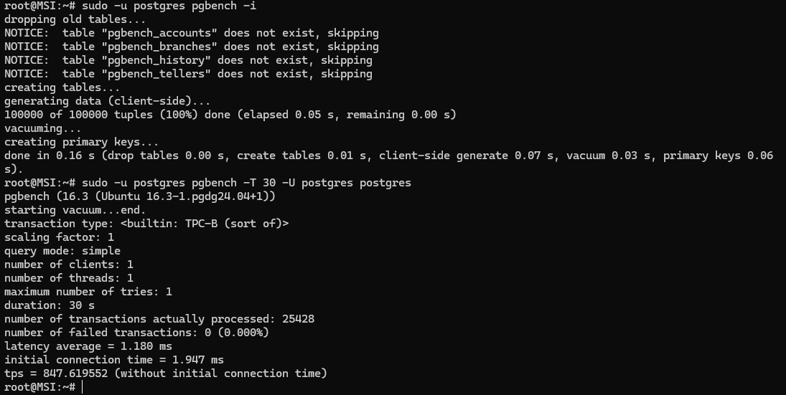
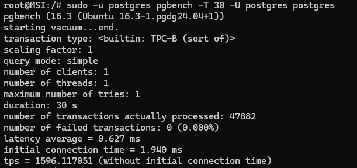

> Занятие 11  
Нагрузочное тестирование и тюнинг PostgreSQL.

---
Упражнение 1 
--- 
Исходные параметры кластера
```ini
 max_connections = 100
 shared_buffers = 128MB
 work_mem = 4MB
 maintenance_work_mem = 64MB
 synchronous_commit = on
 checkpoint_timeout = 5min
```
Результата нагрузочного тестирования:


Устанавливем другие настройки:
```sql
ALTER SYSTEM SET max_connections TO '10';
ALTER SYSTEM SET shared_buffers TO '2048MB';
ALTER SYSTEM SET work_mem TO '64MB';
ALTER SYSTEM SET maintenance_work_mem TO '256MB';
ALTER SYSTEM SET synchronous_commit TO 'off';
ALTER SYSTEM SET checkpoint_timeout TO '60min';
```
Перезагружаем кластер и запускаем повторное тестирование:


Изменение параметров приводит к двукратному увеличению TPS.

---
Упражнение 2* 
--- 
Нагрузочное тестирования при помощи **sysbench**
Устанавливаем пакет sysbench:
```bs
root@MSI:~# curl -s https://packagecloud.io/install/repositories/akopytov/sysbench/script.deb.sh | sudo bash
root@MSI:~# sudo apt -y install sysbench
```
Подготавливаем базу которая будет использована при тестировании:
```sql
CREATE USER sbtest WITH PASSWORD 'password';
CREATE DATABASE sbtest;
GRANT ALL PRIVILEGES ON DATABASE sbtest TO sbtest;
\c sbtest
GRANT CREATE ON SCHEMA public TO sbtest;
GRANT USAGE ON SCHEMA public TO sbtest;
```
Вызываем скрипт подготовки, который создаст необходимые таблицы:
```bs
root@MSI:~# sudo -u postgres sysbench \
--db-driver=pgsql \
--threads=1 \
--pgsql-host=localhost \
--pgsql-port=5432 \
--pgsql-user=sbtest \
--pgsql-password=password \
--pgsql-db=sbtest /usr/share/sysbench/oltp_read_write.lua \
prepare
sysbench 1.0.20 (using system LuaJIT 2.1.0-beta3)

Creating table 'sbtest1'...
Inserting 10000 records into 'sbtest1'
Creating a secondary index on 'sbtest1'...
```
Вызываем непосредственное тестирование:
```bs
root@MSI:~# sudo -u postgres sysbench \
--db-driver=pgsql \
--threads=1 \
--pgsql-host=localhost \
--pgsql-port=5432 \
--pgsql-user=sbtest \
--pgsql-password=password \
--pgsql-db=sbtest /usr/share/sysbench/oltp_read_write.lua \
run
sysbench 1.0.20 (using system LuaJIT 2.1.0-beta3)

Running the test with following options:
Number of threads: 1
Initializing random number generator from current time


Initializing worker threads...

Threads started!

SQL statistics:
    queries performed:
        read:                            42602
        write:                           12172
        other:                           6086
        total:                           60860
    transactions:                        3043   (304.17 per sec.)
    queries:                             60860  (6083.41 per sec.)
    ignored errors:                      0      (0.00 per sec.)
    reconnects:                          0      (0.00 per sec.)

General statistics:
    total time:                          10.0029s
    total number of events:              3043

Latency (ms):
         min:                                    1.95
         avg:                                    3.29
         max:                                  107.88
         95th percentile:                        3.96
         sum:                                 9997.03

Threads fairness:
    events (avg/stddev):           3043.0000/0.00
    execution time (avg/stddev):   9.9970/0.00
```